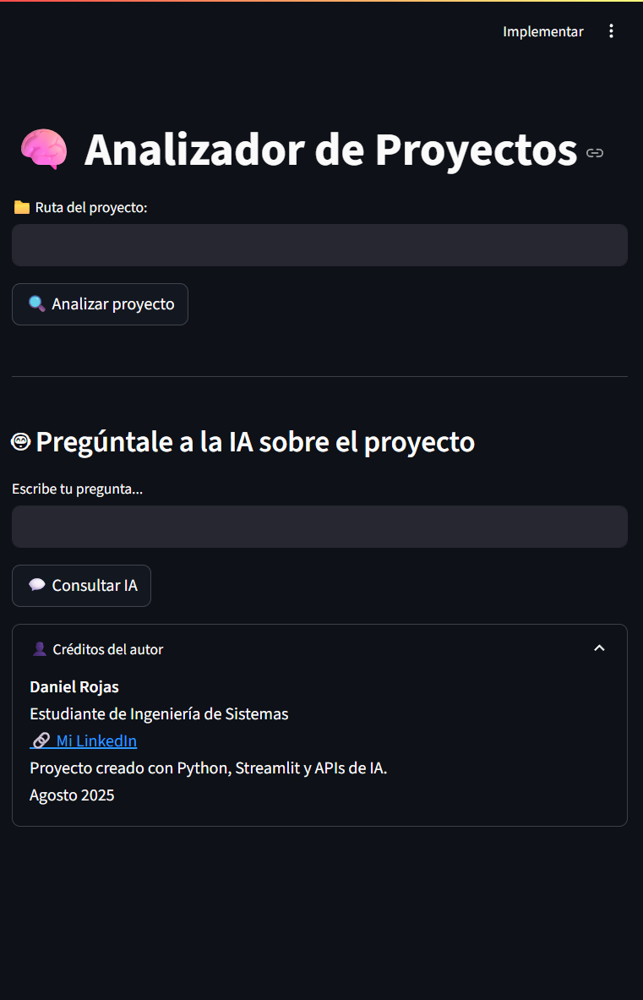

# 🧠 Analizador Inteligente de Proyectos con IA

Este proyecto permite analizar cualquier carpeta de código para detectar automáticamente los archivos más importantes, generar un resumen del proyecto localmente (sin consumir tokens), y consultar a una IA usando un resumen optimizado.

Es ideal para estudiantes, desarrolladores y revisores que necesiten entender rápidamente un proyecto grande.

---

## 🔍 ¿Qué hace esta aplicación?

- 📁 Explora una carpeta de proyecto y genera un árbol con los archivos clave.
- ✂️ Resume el contenido localmente para ahorrar tokens al usar IA.
- 🤖 Permite hacerle preguntas al proyecto a través de una IA (vía OpenRouter).
- ✅ Todo desde una interfaz sencilla con Streamlit.

---

## ⚙️ Tecnologías utilizadas

- 🐍 Python 3.10+
- 📦 Streamlit
- 🔐 dotenv
- 🔗 OpenRouter API (gratuita)

---

## 🚀 Cómo usarlo

1. **Clona el repositorio:**
   ```bash
   git clone https://github.com/dsrojasal/analizador-proyectos-ia.git

2. **Entra a la carpeta del proyecto:**

cd analizador-proyectos-ia

3. **Instala las dependencias:**

pip install -r requirements.txt

4. **Crea el archivo .env con tu API Key:**

env
OPENROUTER_API_KEY=tu_api_key_aqui

5. **Ejecuta la aplicación:**

streamlit run main.py
📸 Capturas de pantalla


🙋‍♂️ Autor
Daniel Rojas
Estudiante de Ingeniería de Sistemas
📍 Colombia
🔗 Mi https://www.linkedin.com/in/danielrojas123/
📧 danielsantiagorojas123@gmail.com

📄 Licencia

Este proyecto está licenciado bajo la Licencia MIT.  
Consulta el archivo [LICENSE](LICENSE) para más detalles.
